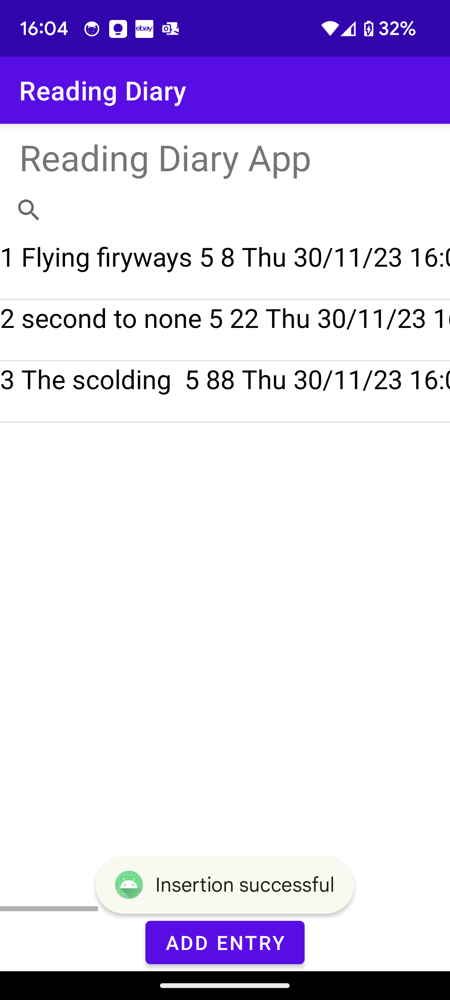
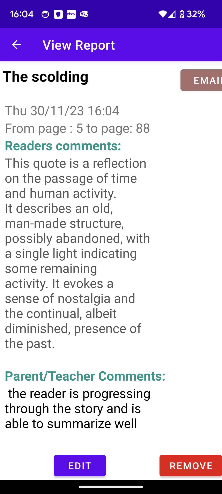
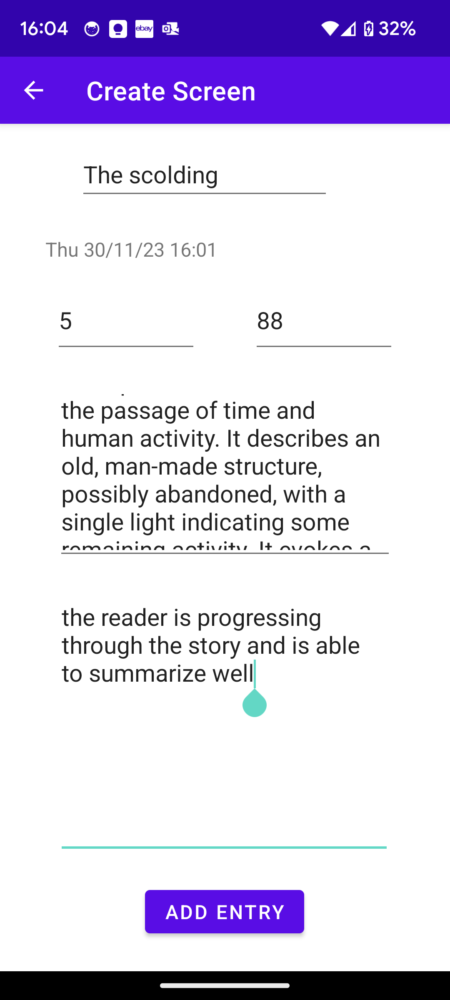
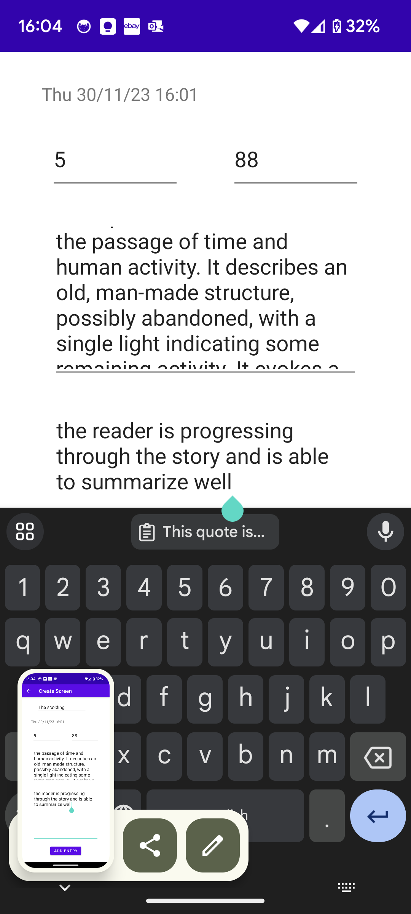
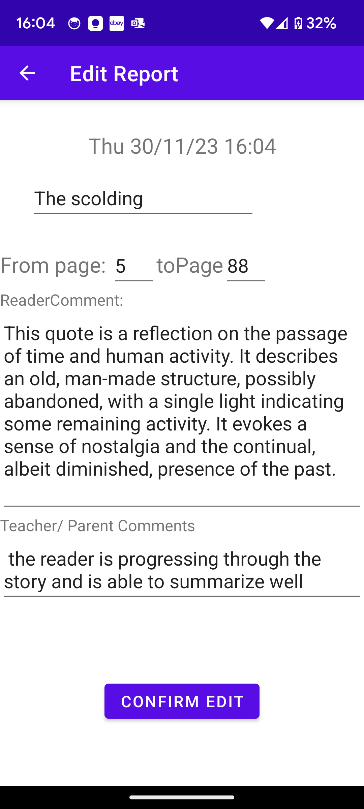
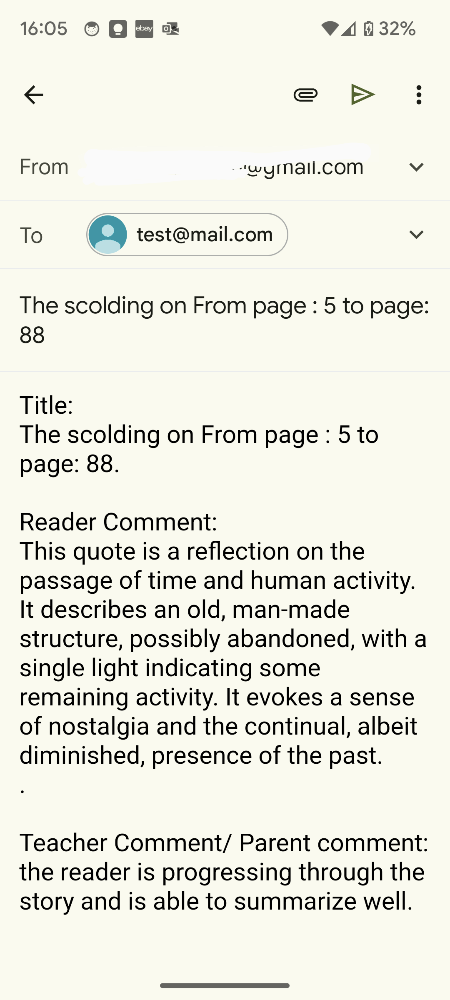

# Android-app---BookDiary
Android studio application Crete and edit entries that are supposed to be book reading record Email intent

     
    Features:
      - Add book event with
      - title
      - page from and to
      - reader comments
      - supported comment

